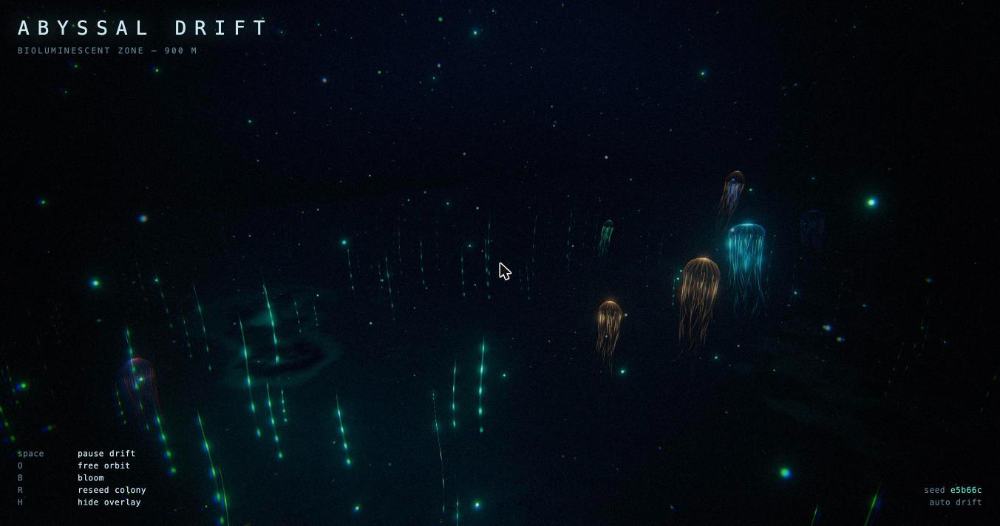

# Abyssal Drift

A bioluminescent deep-sea scene in Three.js — a colony of pulsing jellyfish drifting through
a dark water column over a glowing seafloor, with a slow camera dolly on a closed path.

Theme was picked at random from a shortlist; everything else follows the skills in
`../threejs-skills/skills/`.



## Run it

Needs a static server (ES modules and the import map won't load over `file://`):

```bash
cd animations
python3 -m http.server 8777
# then open http://localhost:8777/
```

Three.js r185 is pulled from unpkg via an import map — no build step, no `node_modules`.

## Controls

| Key     | Action                                                  |
| ------- | ------------------------------------------------------- |
| `space` | Pause the drift (freezes time; the camera stops with it) |
| `O`     | Toggle free orbit (OrbitControls) vs. the auto dolly     |
| `B`     | Toggle the bloom pass                                    |
| `R`     | Reseed the colony — disposes the old world, builds a new |
| `H`     | Hide the overlay                                         |

Every scene is reproducible: the seed is shown bottom-right and written to the URL as
`?seed=…`, so `http://localhost:8777/?seed=1f0wd4c` always rebuilds the same colony.

## What's in the scene

| File             | Contents                                                                            |
| ---------------- | ----------------------------------------------------------------------------------- |
| `src/main.js`    | Renderer, camera rig on a `CatmullRomCurve3`, input, resize, animation loop          |
| `src/world.js`   | Assembles one seeded world and owns its disposal                                     |
| `src/jellyfish.js` | Bells (vertex-shader jet propulsion + fresnel) and tentacles (one `LineSegments` batch per animal) |
| `src/kelp.js`    | Siphonophore stalks — a single `InstancedMesh`, bend derived from the instance matrix |
| `src/particles.js` | Marine snow and rising plankton motes; two `Points` systems, wrapped in the shader  |
| `src/environment.js` | Gradient dome, displaced seafloor with bacterial mats, billboarded light shafts  |
| `src/terrain.js` | The seafloor height field, in JS so the kelp can root to the exact same surface       |
| `src/post.js`    | `EffectComposer`: bloom → water pass (wobble, chromatic edges, grade, vignette, grain) → `OutputPass` |
| `src/glsl.js`    | Shared GLSL: value noise / fbm, and one `FogExp2` formula                             |
| `src/rng.js`     | Seeded PRNG (mulberry32)                                                             |

### Design notes

- **Everything animated is animated on the GPU.** Per frame the CPU updates a handful of
  `uTime` uniforms and nine jellyfish transforms; the ~5,100 particles, 260 kelp stalks and
  every tentacle move in their vertex shaders.
- **Fog is manual.** All materials here are custom `ShaderMaterial`s, which bypass the
  built-in fog chunks, so one shared pair of uniforms (`uFogColor`, `uFogDensity`) is spread
  into each material and applied with the `fogAmount()` helper in `glsl.js`.
- **Transparency is additive with `depthWrite: false`**, which suits bioluminescence and
  sidesteps sort-order artefacts between overlapping bells, tentacles and stalks.
- **The seafloor height field lives in JS, not GLSL.** A `fract(sin(x))` hash does not give
  identical results on CPU and GPU, so a shader-side copy would leave the kelp floating above
  or buried under the dunes.
- `prefers-reduced-motion` slows the whole simulation to 35% rather than freezing it.

### Skills referenced

`threejs-fundamentals` (scene/camera/renderer, `Clock`, resize, disposal),
`threejs-geometry` (instancing, custom buffer attributes, geometry transforms),
`threejs-shaders` (`ShaderMaterial`, uniforms, varyings, fresnel, vertex displacement, noise),
`threejs-materials` (additive blending, transparency),
`threejs-postprocessing` (`EffectComposer`, `UnrealBloomPass`, custom `ShaderPass`, `OutputPass`),
`threejs-animation` (procedural oscillation, frame-rate-independent damping),
`threejs-interaction` (`OrbitControls`, keyboard input).

### Verified

Runs clean in Chrome at a steady 120 fps (1456×828, DPR 2), no console errors, and frame rate
holds after repeated reseeds — the disposal path doesn't leak.
