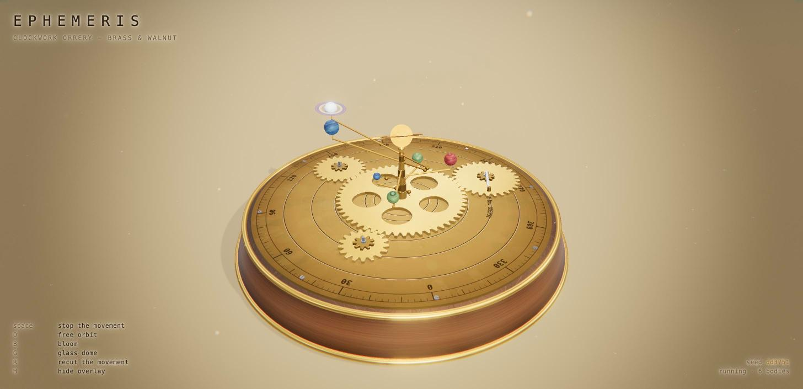

# Ephemeris

A clockwork orrery in Three.js — a brass-and-walnut planetary machine turning on an engraved dial
plate, driven by a sun-and-planet gear train, lit as a real object in a real room.

Theme was picked at random from a shortlist, then deliberately steered away from its two siblings in
this gallery: both of those are dark scenes built out of additive, unlit `ShaderMaterial`s. This one
is bright, hard-surfaced and physically lit — PBR metal and wood, a shadow-casting key light, an
image-based environment, and every map painted procedurally into a canvas.



## Run it

Needs a static server (ES modules and the import map won't load over `file://`):

```bash
cd animations
python3 -m http.server 8777
# then open http://localhost:8777/
```

Three.js r185 is pulled from unpkg via an import map — no build step, no `node_modules`.

## Controls

| Key     | Action                                                             |
| ------- | ------------------------------------------------------------------ |
| `space` | Stop the movement (freezes time; the camera stops with it)          |
| `O`     | Toggle free orbit (OrbitControls) vs. the automatic camera          |
| `B`     | Toggle the bloom pass                                              |
| `G`     | Lower the glass vitrine over the movement                          |
| `R`     | Recut the movement — disposes the old instrument, builds a new one  |
| `H`     | Hide the overlay                                                   |

Every instrument is reproducible: the seed is shown bottom-right and written to the URL as `?seed=…`,
so `http://localhost:8777/clockwork-orrery/?seed=8mqfl` always cuts the same movement.

## What's in the scene

| File              | Contents                                                                                  |
| ----------------- | ----------------------------------------------------------------------------------------- |
| `src/main.js`     | Renderer, camera on a spherical orbit rig, IBL bake, input, resize, animation loop         |
| `src/stage.js`    | The room — backdrop, floor, key/rim/fill lights, dust. Fixed seed; survives every recut    |
| `src/world.js`    | Assembles one seeded instrument and owns its disposal                                     |
| `src/plinth.js`   | Walnut carcase, brass bands, bun feet, the engraved dial plate, the glass vitrine          |
| `src/gears.js`    | Gear teeth as `Shape` → `ExtrudeGeometry`, plus the sun-and-planet train and its phasing   |
| `src/orrery.js`   | Orbit plan, stepped column, `LatheGeometry` finial, arms, bodies, moons, ring, the lamp     |
| `src/motes.js`    | House dust in the window light; one `Points` system moved in its vertex shader             |
| `src/materials.js`| The PBR material bench — brass, aged brass, steel, walnut, enamel, glass                  |
| `src/textures.js` | Every map, drawn into a 2D canvas: dial engraving, walnut figure, enamel bodies, rings      |
| `src/post.js`     | `EffectComposer`: bloom → atrium pass (dispersion, split tone, vignette, grain) → `OutputPass` |
| `src/glsl.js`     | Shared GLSL: value noise / fbm                                                            |
| `src/rng.js`      | Seeded PRNG (mulberry32)                                                                  |

### Design notes

- **Nothing here writes a lighting model.** A key light with a real shadow map, a hemisphere fill and
  an image-based environment do all of it. The environment is the load-bearing part: polished brass
  is almost entirely reflection, and without something to reflect it renders as flat orange however
  many lamps you add. `RoomEnvironment` is baked through `PMREMGenerator` once at startup.
- **Gears are meshed by arithmetic, not by eye.** With a shared module `m`, a wheel of `N` teeth has
  pitch radius `mN/2`, so two wheels mesh at `m(N₁+N₂)/2` apart. Interlocking also constrains _phase_
  — a tooth of one must meet a gap of the other along the line of centres. Rolling contact gives
  `ψ₂ = α + π + (π − N₁(ψ₁ − α))/N₂`, which is linear in `ψ₁`: evaluate it once for the offset, then
  spin at `ω₂ = −ω₁N₁/N₂` and the teeth stay meshed indefinitely.
- **The satellite tooth pool is derived from the plate radius**, not hard-coded. A satellite's
  outermost tooth sits at `m(N_great/2 + N + 0.85)` from the axis, so the plate caps the tooth count.
  An earlier hard-coded pool let the largest wheel hang over the rim.
- **The dial plate is satin, not mirror.** This was the one real visual bug: at metal roughness a
  polished plate mirrors the central lamp straight into the camera for a good part of the orbit,
  flooding the engraving with white. The plate's roughness map is deliberately light — the brass
  keeps its colour and its lustre from the environment, and the glare never returns.
- **Colour and roughness for the dial are painted by the same routine**, with two ink palettes, so the
  engraving lines up between the two maps and the grooves come out both darker and duller than the
  field. `CylinderGeometry` maps its caps as a disc inscribed in the UV square, which is what lets
  concentric canvas artwork land on the right radii; the plate takes a material per geometry group so
  its rim stays plain brass.
- **The room and the instrument have separate lifetimes.** `stage.js` is built from a fixed seed and
  is never rebuilt; only `world.js` is disposed and recut on `R`. The room you are standing in should
  not swap out because a wheel was recut.
- **Fog is the built-in kind.** Almost every material here is a lit PBR material, so `scene.fog`
  reaches them for free — no manual fog uniforms. Its colour is matched to the backdrop's horizon
  stop so the floor dissolves into the wall rather than ending on a visible edge.
- **The scene graph does the animation.** Arm, axial spin and moon are three nested `Object3D`s, so
  the compound motion falls out of the parent transforms instead of being positioned per frame.
- **Clear glass renders as nothing.** Physically correct, visually useless: the vitrine is read from
  its brass instead — a seating ring, six meridian ribs and a finial. Transmission stays high because
  whatever is _not_ transmitted shows up as white haze over the movement.
- The ring system never casts a shadow: an alpha-cut ring casts a solid disc, which would band the
  body it belongs to.
- `prefers-reduced-motion` slows the whole simulation to 35% rather than freezing it.

### Skills referenced

`threejs-fundamentals` (scene/camera/renderer, `Clock`, resize, `Object3D` hierarchy, disposal),
`threejs-geometry` (`Shape`/`ExtrudeGeometry`, `LatheGeometry`, `TorusGeometry`, per-group materials),
`threejs-materials` (`MeshStandardMaterial`, `MeshPhysicalMaterial` transmission, metal vs. dielectric),
`threejs-textures` (`CanvasTexture`, colour space for colour vs. data maps, wrapping, anisotropy),
`threejs-lighting` (directional key + shadow-map tuning, `HemisphereLight`, IBL via `PMREMGenerator`),
`threejs-postprocessing` (`EffectComposer`, `UnrealBloomPass`, custom `ShaderPass`, `OutputPass`),
`threejs-animation` (nested procedural rotation, frame-rate-independent damping),
`threejs-shaders` (`ShaderMaterial` for the backdrop and the dust, value noise, point sprites),
`threejs-interaction` (`OrbitControls`, keyboard input).

### Verified

Runs in Chrome 150 at 1456×705, DPR 2, holding ~116 fps against a 120 Hz display. All six keys were
exercised; the frame rate holds after thirteen consecutive recuts with no console errors, so the
disposal path doesn't leak. The worst frame in that run was 75 ms — a recut, which repaints every
canvas map synchronously.
