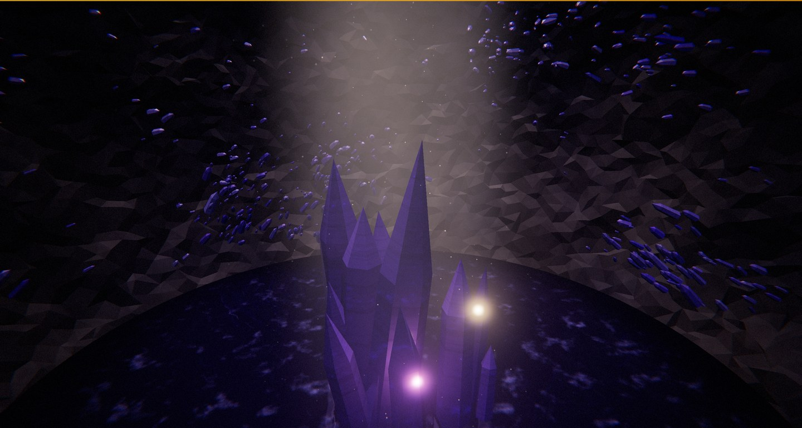

# Druse

A crystal-lined geode in Three.js — the inside of a sealed cavity in rock, lit by a single
shaft of daylight through a crack in its roof, with a mineral pool in the bottom that
reflects it.

*Druse*: the crust of crystals that lines a rock cavity.

Theme was picked at random from a shortlist; everything else follows the skills in
`../threejs-skills/skills/`.



## Run it

Needs a static server (ES modules and the import map won't load over `file://`):

```bash
cd animations
python3 -m http.server 8777
# then open http://localhost:8777/
```

Three.js r185 is pulled from unpkg via an import map — no build step, no `node_modules`.

## Controls

| Key     | Action                                                             |
| ------- | ------------------------------------------------------------------ |
| `space` | Pause the sun (freezes time; the beam and the camera stop with it)  |
| `O`     | Toggle free orbit (OrbitControls) vs. the auto dolly               |
| `B`     | Toggle the bloom pass                                              |
| `C`     | Cycle the mineral — amethyst, citrine, aquamarine, smoky quartz     |
| `R`     | Recut the cavity — disposes the old one, builds a new               |
| `H`     | Hide the overlay                                                   |

Every cavity is reproducible: the seed and the mineral are shown bottom-right and written to
the URL, so `http://localhost:8777/crystal-geode-cavern/?seed=1lmpqr&mineral=0` always
rebuilds the same stone. Cycling the mineral keeps the habit fixed and changes only the
stone, so `C` really is the same cavity cut from something else.

## What's in the scene

| File               | Contents                                                                              |
| ------------------ | ------------------------------------------------------------------------------------- |
| `src/main.js`      | Renderer, camera rig on a `CatmullRomCurve3`, input, resize, animation loop            |
| `src/world.js`     | Assembles one seeded cavity and owns its disposal                                      |
| `src/cavity.js`    | The wall in polar form, plus the crack — plain JS, shared by the rock and the crystals |
| `src/shell.js`     | The rock: a welded, displaced, vertex-jittered icosphere with the crack's faces deleted |
| `src/crystals.js`  | The druse (one `InstancedMesh`, ~1,300 crystals) and the transmissive hero cluster      |
| `src/pool.js`      | `Reflector` with a replacement shader — rippled, Fresnel-mixed, ragged at the shore    |
| `src/shaft.js`     | The beam of daylight, its slow sweep, and the dust that makes it visible               |
| `src/lighting.js`  | The key light aimed by the beam, bounce, hemisphere fill, and the baked IBL             |
| `src/textures.js`  | Canvas maps: crystal growth zoning and healed-fracture veils                           |
| `src/minerals.js`  | The four mineral habits                                                                |
| `src/post.js`      | `EffectComposer`: bloom → split-tone grade (aberration, vignette, grain) → `OutputPass` |
| `src/glsl.js`      | Shared GLSL: 2D/3D value noise and fbm, and one `FogExp2` formula                      |
| `src/rng.js`       | Seeded PRNG (mulberry32) with a central-limit normal                                   |

### Design notes

- **The cavity's shape lives in JavaScript, not GLSL.** The rock is displaced by the same
  function that roots every crystal, so a shader-side copy would drift — `fract(sin(x))` is
  not bit-identical across CPU and GPU — and thousands of crystals would float off the wall
  or sink into it. (The seafloor in `../bioluminescent-jellyfish` learned this first.)
- **The crack is cut by deleting index triples**, not by CSG, with a noise-modulated
  threshold so the lip comes out torn rather than drilled. The rock does not cast shadows,
  which is what lets the key light through the wall in the first place.
- **The rock is flat-shaded, and its vertices are jittered.** It is lit almost entirely by
  ambient and one environment map, neither of which has direction, so smooth normals gave a
  grey cloud with mottling painted on it. Flat shading gives every triangle its own tone —
  but a subdivided icosahedron is regular enough that flat shading turns it into a visible
  quilt, so each vertex is nudged by a fraction of an edge, across the surface as well as
  through it.
- **Crystals come in two tiers for a rendering reason.** `transmission` refracts through the
  *mesh's* model matrix, which every instance of an `InstancedMesh` shares — 1,300 crystals
  would all refract as one. So the crust is opaque (clearcoat, low roughness, a strong
  environment term, per-instance colour) and only the dozen hero crystals are transmissive.
  The transmission pass is drawn once per frame regardless of how many objects want it.
- **Hero geometry is built at its finished size.** Three.js measures the refraction ray as
  `thickness × modelScale`, so a shared unit crystal stretched twenty units tall is treated
  as twenty units *thick* — Beer-Lambert absorption over that distance takes it to solid
  black. The scale has to live in the vertices, where the absorption cannot see it.
- **The key light is a `SpotLight` doing an impression of the sun**: parked 200 units back up
  the beam with `decay` set to zero, so the cone is near enough parallel across the crack and
  the far wall is lit as brightly as the near one.
- **The beam sweeps.** It is the scene's clock — the key light and the dust both take their
  direction from it each frame, so the drawn shaft, the lit patch on the water and the
  brightened motes never disagree.
- **The pool is a real planar mirror**, not an environment-map fake, because the hero cluster
  stands in it and the waterline is the one place the eye checks for parallax. It renders the
  scene a second time at half resolution; the ripples hide the resampling.
- **The pool outlives a recut.** `Reflector` owns a virtual camera, and Three.js caches the
  transmission pass's render target in a `WeakMap` keyed by camera — so a fresh Reflector per
  cut stranded a full-size half-float target every time, with no handle left to dispose it.
  The waterline is identical for every cut, so building it once fixes the leak and the work.
- `prefers-reduced-motion` slows the whole simulation to 35% rather than freezing it.

### Skills referenced

`threejs-fundamentals` (scene/camera/renderer, `Clock`, resize, disposal),
`threejs-geometry` (icosphere displacement, `mergeVertices`, `mergeGeometries`, index editing,
instancing),
`threejs-materials` (`MeshPhysicalMaterial` transmission, volume attenuation, clearcoat,
iridescence, flat shading, per-instance colour),
`threejs-lighting` (shadow-casting spot, hemisphere fill, `PMREMGenerator.fromScene` IBL),
`threejs-textures` (`CanvasTexture`, colour space conventions for data vs. colour maps),
`threejs-shaders` (custom `ShaderMaterial`s, and `onBeforeCompile` injection into a stock
`MeshStandardMaterial`),
`threejs-postprocessing` (`EffectComposer`, `UnrealBloomPass`, custom `ShaderPass`,
`OutputPass`),
`threejs-animation` (swept key light, frame-rate-independent damping),
`threejs-interaction` (`OrbitControls`, keyboard input).

### Verified

Runs clean in headed Chrome (ANGLE/Metal) with no console errors, at 54 fps on a 2972×1590
drawing buffer — the cost is the second scene render for the mirror plus the transmission
pass. Thirty consecutive recuts hold the GPU texture count flat at 22 and the geometry count
inside its expected range, and the scene keeps exactly five children, so the disposal path
does not leak.
