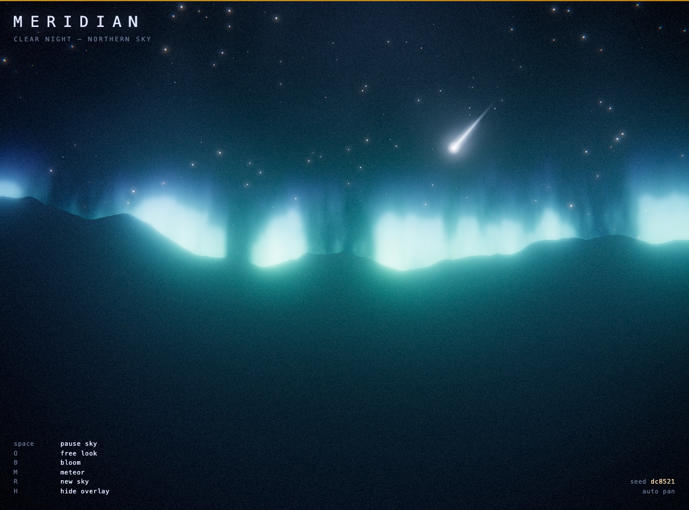

# Meridian

A wheeling night sky in Three.js — a starfield turning slowly around the celestial pole above a
silhouetted ridge, with the Milky Way, a phased moon, aurora curtains on the horizon, and the odd
meteor. The observer stands near the centre and pans, so the sky sweeps past the skyline.

Everything follows the skills in `../../threejs-skills/skills/`.



## Run it

Needs a static server (ES modules and the import map won't load over `file://`):

```bash
cd animations
python3 -m http.server 8777
# then open http://localhost:8777/starlit-night-sky/
```

Three.js r185 is pulled from unpkg via an import map — no build step, no `node_modules`.

## Controls

| Key     | Action                                                      |
| ------- | ----------------------------------------------------------- |
| `space` | Pause the sky (freezes time; the pan and wheel stop with it) |
| `O`     | Toggle free look (OrbitControls) vs. the auto pan            |
| `B`     | Toggle the bloom pass                                        |
| `M`     | Fire a meteor now                                            |
| `R`     | New sky — disposes the old world, builds a new one           |
| `H`     | Hide the overlay                                             |

Every sky is reproducible: the seed is shown bottom-right and written to the URL as `?seed=…`, so
`http://localhost:8777/starlit-night-sky/?seed=dc8521` always rebuilds the same one.

## What's in the scene

| File               | Contents                                                                                   |
| ------------------ | ------------------------------------------------------------------------------------------ |
| `src/main.js`      | Renderer, ground-observer camera rig, input, resize, animation loop, disposal              |
| `src/world.js`     | Assembles one seeded night; splits it into a fixed frame and a tilted, spinning celestial group |
| `src/sky.js`       | Gradient atmosphere dome with a directional horizon airglow and faint high cloud            |
| `src/stars.js`     | The ~6,000-star field (twinkle + temperature colour in the vertex shader); shared star material |
| `src/milkyway.js`  | ~9,000 band stars rejection-sampled toward a great circle, plus an additive fbm dust shell  |
| `src/moon.js`      | Phased moon (procedural maria, view-relative lighting) with a billboarded halo              |
| `src/aurora.js`    | Curtains bent onto an arc, lit by drifting vertical fbm rays, green at the base to violet up |
| `src/meteors.js`   | A pool of billboarded streaks; seeded spawn timing, head-bright trail shader                |
| `src/terrain.js`   | Two ridge silhouettes wrapped on cylinders, crest carved by a fragment-side ridge line       |
| `src/post.js`      | `EffectComposer`: bloom → night pass (edge chromatic, cool grade, vignette, grain) → `OutputPass` |
| `src/glsl.js`      | Shared GLSL: 2D and 3D value noise / fbm                                                     |
| `src/rng.js`       | Seeded PRNG (mulberry32)                                                                     |

### Design notes

- **Everything animated is animated on the GPU.** Per frame the CPU updates a couple of shared
  uniforms, spins one group, and moves the handful of active meteor transforms; the ~15,000 stars
  twinkle, the nebula drifts, the aurora folds and the meteor trails all move in their shaders.
- **Two coordinate frames.** The atmosphere (dome, ridge, aurora, meteors) is fixed to the observer,
  so the horizon glow stays put. The stars, Milky Way and moon hang off a group tilted ~30° off the
  zenith and spun slowly, so they wheel around the pole the way real constellations do.
- **The moon is lit in world space, from the view direction plus a fixed offset.** Because it rides
  inside the tilted, spinning group, a fixed object-space light would point in an arbitrary direction
  and often render the far side — a dark disc. Lighting relative to the camera guarantees the near
  face always reads as a moon, with a soft terminator nudged onto one limb.
- **The Milky Way is two layers.** Faint stars rejection-sampled toward a great circle give the grain;
  an additive `fbm3` shell along the same axis gives the glow, with dark dust lanes subtracted out.
- **Point sizes scale with the drawing-buffer height**, so stars keep the same on-screen size across
  resizes and pixel ratios.
- **Glow is additive with `depthWrite: false`** (stars, nebula, aurora, meteors, moon halo). The ridge
  and moon disc are opaque and write depth, so the sky is correctly occluded below the horizon and
  behind the moon.
- All materials here are custom `ShaderMaterial`s, so the built-in fog and lighting chunks are bypassed
  in favour of one shared atmosphere.
- `prefers-reduced-motion` slows the whole simulation to 35% rather than freezing it.

### Skills referenced

`threejs-fundamentals` (scene/camera/renderer, `Clock`, resize, disposal, group hierarchy),
`threejs-geometry` (`Points`, custom buffer attributes, cylinder/plane/sphere, world transforms),
`threejs-shaders` (`ShaderMaterial`, uniforms, varyings, value/fbm noise, point sprites, phase shading),
`threejs-materials` (additive blending, transparency, depth interplay),
`threejs-postprocessing` (`EffectComposer`, `UnrealBloomPass`, custom `ShaderPass`, `OutputPass`),
`threejs-animation` (procedural oscillation, frame-rate-independent damping),
`threejs-interaction` (`OrbitControls`, keyboard input).

### Verified

Rendered in a desktop Chromium (headed) on an Apple M3 Pro via ANGLE/Metal, WebGL2, at 1200×924.
All custom shaders compile and the scene runs with no console errors (only a benign `THREE.Clock`
deprecation notice). Stars, Milky Way, moon, aurora, meteors, ridge and the full post chain were each
confirmed on-screen; seeds reproduce and `R` reseeds without leaking. Needs a WebGL2-capable browser.
