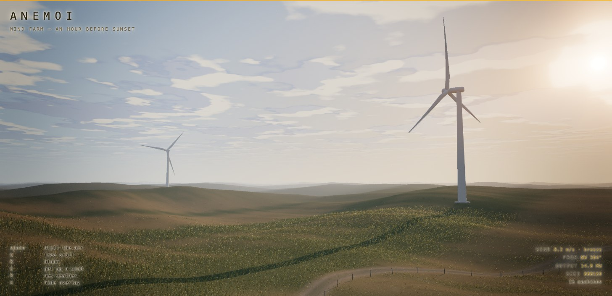

# Anemoi

A wind farm on a grass steppe in Three.js — a quarter of a million blades of grass, sixteen machines
and a sheet of cloud, all reading from the same wind field, an hour before sunset.

Theme was picked at random from a shortlist, then steered away from its three siblings in this
gallery: two of those are dark scenes built out of additive, unlit `ShaderMaterial`s, and the third
is a bright object on a table indoors. This one is outdoors, at landscape scale, lit by a single
low sun — the case where almost everything on screen is either backlit or in shadow.



## Run it

Needs a static server (ES modules and the import map won't load over `file://`):

```bash
cd animations
python3 -m http.server 8777
# then open http://localhost:8777/
```

Three.js r185 is pulled from unpkg via an import map — no build step, no `node_modules`.

## Controls

| Key     | Action                                                                     |
| ------- | -------------------------------------------------------------------------- |
| `space` | Still the air (freezes time; the camera stops with it)                      |
| `O`     | Toggle free orbit (OrbitControls) vs. the automatic camera                  |
| `B`     | Toggle the bloom pass                                                       |
| `G`     | Get up a wind — cycles calm → breeze → fresh → gale                         |
| `R`     | New weather — disposes the old steppe and cuts a new one                    |
| `H`     | Hide the overlay                                                            |

Every afternoon is reproducible: the seed is shown bottom-right and written to the URL as `?seed=…`,
so `http://localhost:8777/windswept-turbine-field/?seed=a1` always cuts the same weather.

## What's in the scene

| File               | Contents                                                                                     |
| ------------------ | -------------------------------------------------------------------------------------------- |
| `src/main.js`      | Renderer, camera rig, input, resize, animation loop                                           |
| `src/wind.js`      | The wind field — one seeded model, emitted as both JS and GLSL                                |
| `src/world.js`     | Assembles one seeded afternoon and owns its disposal                                          |
| `src/sky.js`       | Sky dome, sun, cloud sheet, the two lights, and the shared uniform block                      |
| `src/shading.js`   | Patches cloud shadow, translucency and directional haze into ordinary lit materials           |
| `src/field.js`     | Height field, grass cover, service track, the ground disc and its painted maps                |
| `src/grass.js`     | 220 000 instanced blades, bent in the vertex shader                                           |
| `src/turbines.js`  | Lofted blades, lathed nacelles, farm layout, yaw and rotor control, the power curve           |
| `src/fence.js`     | The stock fence along the track — the near-field scale cue                                    |
| `src/pollen.js`    | Seed heads riding the wind; one `Points` system, wrapped around the camera                    |
| `src/post.js`      | `EffectComposer`: bloom → golden-hour grade (crepuscular rays, split tone, vignette, grain)    |
| `src/glsl.js`      | Shared GLSL: value noise / fbm, and the cloud sheet both the sky and the ground read          |
| `src/rng.js`       | Seeded PRNG (mulberry32)                                                                     |

### Design notes

- **One wind field, read by everything.** The grass bends with it, the rotors take both their speed
  and their yaw from it, the seed heads drift on it, the cloud sheet is carried by it, and the
  readout reports it. Because it is one field rather than a handful of unrelated oscillators, a gust
  front arrives at the near turbine a beat after it has run through the foreground grass.
- **The field is advected by a distance, not by a time.** Every travelling term is `sin(k·x − k·φ)`
  where `φ` is metres of air that have gone past, integrated as `φ += speed·dt`. Written the obvious
  way, `sin(k·x − k·v·t)`, changing `v` ninety seconds in teleports the whole pattern by `90·Δv·k`
  radians — a visible jolt across the entire steppe every time the wind picks up. With a phase,
  pressing `G` is exactly as smooth as air is.
- **The GLSL and the JS are generated from the same constants.** The shaders need the field
  per-vertex and the turbines need it per-object, so it necessarily exists twice; emitting the GLSL
  from the numbers the JS closes over is what keeps the blades of grass and the blades of the rotor
  in the same weather.
- **Nothing writes a lighting model.** A directional sun with a real shadow map and a hemisphere fill
  do all of it. `shading.js` adds the three things the built-in materials have no notion of: cloud
  shadow, translucency, and haze that changes colour with view angle. Built-in fog is one flat
  colour, which is wrong in every direction at once when the sun is on the deck.
- **The cloud shadows are cast by the clouds you can see.** The sky dome and every ground material
  call the same `cloudSheet()`; the ground projects its own world position up the sun ray onto the
  cloud plane before reading it. With a sun this low the shadow lands kilometres downwind of the
  cloud that casts it, which is correct and is why the two never look pinned together.
- **The grass instance matrices are translation only.** Yaw, height, width, bend and flutter are all
  applied to `position` inside the shader, before the instance matrix, so the blade's local axes
  *are* the world axes — bending downwind is `p.xz += flow * amount` rather than a per-instance
  change of basis, and `instanceMatrix[3].xyz` is the world position every wind sample needs.
- **Distant blades are widened, not lengthened.** Both keep the far field from quietly turning back
  into bare ground, but stretching height grows grass taller than the fence posts, which loses the
  one object in frame whose size the eye already knows.
- **The soil is painted darker than the grass.** This was the change that made a thin sward read as
  a thick one: with a light ground the gaps between blades read as sand, and no amount of extra
  blades fixes it.
- **The ground mesh is a radial disc**, ring spacing growing geometrically from about a metre
  underfoot to ninety at the rim four kilometres out. It spends vertices where the eye is and gives
  a circular horizon that fog can close off without a visible corner.
- **Rotor speed is `ω = λv/R`** at a tip-speed ratio of 7.2 — what a variable-speed turbine's
  controller actually holds — capped at 18 rpm, idling below the 3 m/s cut-in. The same wind goes
  through a `½ρAv³Cp` power curve, so the megawatts in the corner are the farm's real output for the
  weather on screen. Rows run across the prevailing wind, four rotor diameters apart, seven
  diameters downwind.
- **The crepuscular rays are a radial blur of what is already on screen**, thresholded above white
  and marched back toward the sun's projected position. Nothing about them is animated: a rotor
  blade crossing the sun cuts them because it cut the pixels they are built from.
- `prefers-reduced-motion` slows the whole simulation to 35% rather than freezing it.

### Two things that cost an afternoon

- **`UnrealBloomPass` cannot run against a multisampled composer buffer.** Grass a pixel wide is
  exactly what MSAA is for, so the composer was handed a target with `samples: 4`; the frame came
  back flat grey, and black once another pass followed. Bisected by elimination — bloom alone on a
  4× target is flat, the grade alone on the same target is correct, both are correct at zero samples.
  The anti-aliasing budget goes on resolution instead, with a pixel-ratio *floor* of 1.5 so an
  ordinary 1× display supersamples too.
- **Do not call `bloom.setSize()` after `composer.setSize()`.** The composer takes CSS pixels and
  already forwards drawing-buffer pixels to every pass; calling the pass again with CSS pixels halves
  its mip chain and the composite comes back black. It looks like defensive tidiness and it is a bug.

### Skills referenced

`threejs-fundamentals` (scene/camera/renderer, `Timer`, resize, `Object3D` hierarchy, disposal),
`threejs-geometry` (raw `BufferGeometry` for the terrain disc and the lofted rotor blade,
`LatheGeometry`, `CylinderGeometry`, `InstancedMesh`, `mergeGeometries`),
`threejs-materials` (`MeshLambertMaterial`, `MeshStandardMaterial`, per-instance colour,
`ShaderMaterial`, `LineBasicMaterial`),
`threejs-textures` (`CanvasTexture`, colour space for colour vs. data maps, wrapping, anisotropy),
`threejs-lighting` (directional key + shadow-map tuning for a very low sun, `HemisphereLight`),
`threejs-postprocessing` (`EffectComposer`, `UnrealBloomPass`, custom `ShaderPass`, `OutputPass`),
`threejs-animation` (procedural motion from a physical field, frame-rate-independent damping),
`threejs-shaders` (`ShaderMaterial` for the sky and the chaff, `onBeforeCompile` injections into the
built-in materials, `customProgramCacheKey`, value noise, point sprites),
`threejs-interaction` (`OrbitControls`, keyboard input).

### Verified

Runs in Chrome at 1486×783, holding ~93 fps against a 120 Hz display with 220 000 grass blades and
~1.8 M triangles a frame. All six keys were exercised. `renderer.info.memory` holds at 11 geometries
and 18 textures across eighteen consecutive recuts, and the program cache settles at 23 rather than
growing, so the disposal path doesn't leak.
